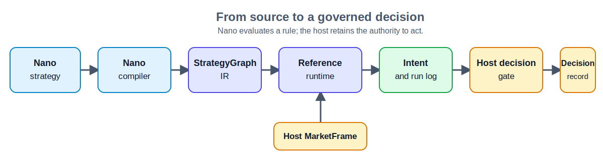

<div align="center">


# Nano

### A deterministic DSL for replayable, host-governed decision rules.

[](https://github.com/DBarr3/Nano/actions/workflows/ci.yml)
[](LICENSE)
[](pyproject.toml)

</div>

> **Write readable trading rules. Replay every outcome. Keep the final decision in your application.**

Nano is a small, Python-embeddable language for transparent threshold rules. It compiles source into validated IR, evaluates host-provided numeric signals deterministically, and returns proposed `Intent` values with an ordered run log. It does not call an exchange, API, or other external system.

**Alpha reference implementation (v0.1.0).** The examples are trading-oriented, but Nano fits any system where a host supplies numeric signals and must retain control over what happens next.

## Why Nano

A rule and an approval are different jobs. Nano makes the rule compact, versioned, and replayable; your application owns data quality, policy, persistence, and real-world effects. That separation makes a decision trail easier to inspect without giving a script authority over your infrastructure.

## Quick start

From a fresh checkout, run the bundled Momentum strategy and then the test suite:

```bash
git clone https://github.com/DBarr3/Nano.git
cd Nano
python -m venv .venv

# macOS/Linux: source .venv/bin/activate
# Windows PowerShell: .venv\Scripts\Activate.ps1

python -m pip install -e ".[dev]"
python examples/momentum_demo.py
python -m pytest -q
```

The demo compiles a checked-in strategy, injects two RSI values, and produces a proposed action:

```text
BUY BTC at timestamp=300 (confidence=0.91)
```

This is the complete `.nano` program it runs:

<!-- README-EXAMPLE:START -->
```nano
strategy Momentum {
  every 5m {
    if RSI(14) < 30 {
      buy(BTC, 0.91)
    }
  }
}
```
<!-- README-EXAMPLE:END -->

`RSI(14)` is a source-level signal convention. In v0.1.0, the host computes and injects the `RSI` series; Nano does not calculate indicators or fetch market data. See the [language reference](docs/language.md) for the exact contract.

## From rule to governed decision



Nano owns parsing, IR validation, and deterministic reference evaluation. The host supplies the `MarketFrame`, applies its `DecisionGate`, stores the result, and performs any real-world action. The same graph and frame produce the same reference result; bridge replay is deterministic when the host gate is deterministic too.

## Start with the strategy library

The [strategy library](nano/library/README.md) is Nano's community on-ramp: a small, tested corpus of familiar trading ideas translated into the DSL. Every entry pairs readable `.nano` source with expected IR, so quant researchers can learn the language, compare conventions, and contribute a new rule with confidence.

| Momentum | Mean reversion | Trend | Volatility | Volume | Risk |
| --- | --- | --- | --- | --- | --- |
| 4 strategies | 3 strategies | 3 strategies | 2 strategies | 2 strategies | 1 strategy |

The library is a conformance corpus, not a performance claim, live signal service, or trading recommendation.

[Browse strategies →](nano/library/README.md) · [Add a strategy →](CONTRIBUTING.md#add-a-strategy) · [Propose a language change →](https://github.com/DBarr3/Nano/issues/new?template=language-change.yml)

## Small by design

| Nano provides | The host retains |
| --- | --- |
| A small strategy source format, validated `StrategyGraph` IR, and deterministic reference evaluation | Signal calculation, data quality, and scheduling |
| Named numeric signal series and AND-only threshold conditions | Policy, approvals, persistence, and external effects |
| Proposed `buy`, `sell`, `execute`, `pause`, and `observe` intents | API calls, exchange execution, and any action with consequences |

The current implementation has no variables, arithmetic, functions, imports, `or`/`not`, type system, CLI, LLM runtime, live data feed, or action executor. [`docs/status.md`](docs/status.md) separates implemented behavior from experimental work and future ideas.

## Build with Nano

Nano stays approachable by keeping its contract narrow and changes reviewable. Contributions are welcome from:

- **Quant researchers** who can add a strategy and document its signal convention.
- **Application engineers** who can improve integrations, replay coverage, documentation, or developer experience.
- **Language contributors** who can start a focused proposal before changing grammar or IR.

See [CONTRIBUTING.md](CONTRIBUTING.md) for the contribution workflow and the [issue templates](.github/ISSUE_TEMPLATE/) for a clear place to begin.

## Documentation

| Need | Start here |
| --- | --- |
| Explore or contribute a strategy | [Strategy library](nano/library/README.md) |
| Learn the grammar and runtime semantics | [Language reference](docs/language.md) |
| Understand module boundaries | [Architecture](docs/architecture.md) |
| Check implemented versus experimental work | [Status](docs/status.md) |
| Integrate or contribute | [Contributing](CONTRIBUTING.md) |
| Report a security concern | [Security policy](SECURITY.md) |

The [paper series](docs/papers/README.md) records design arguments and research directions; source and tests define current behavior.
